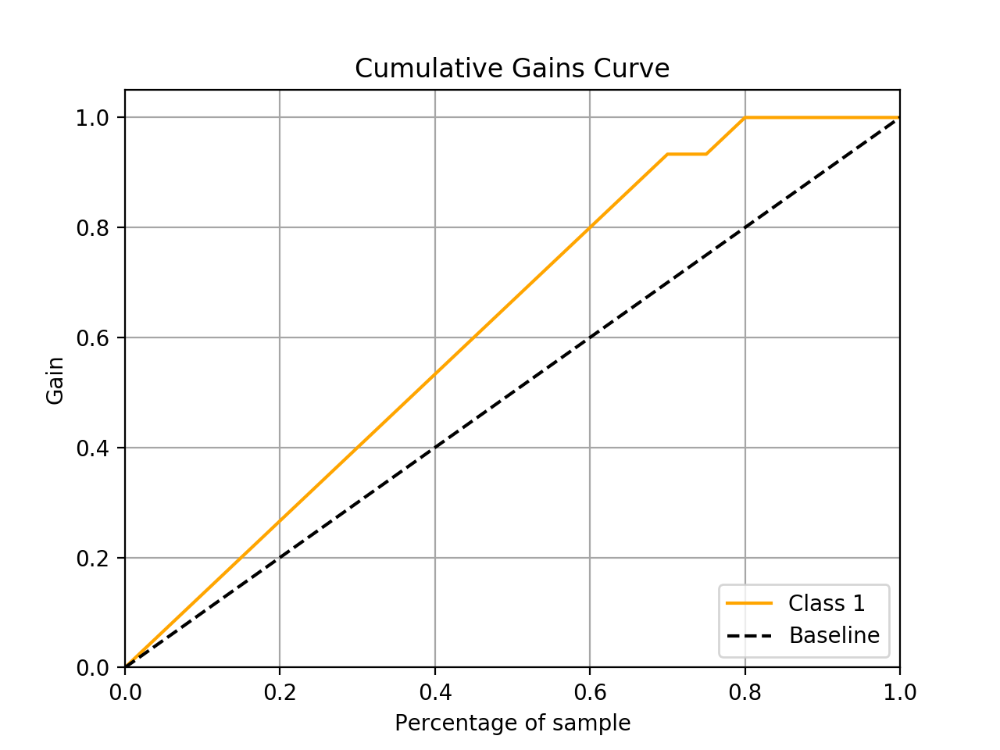
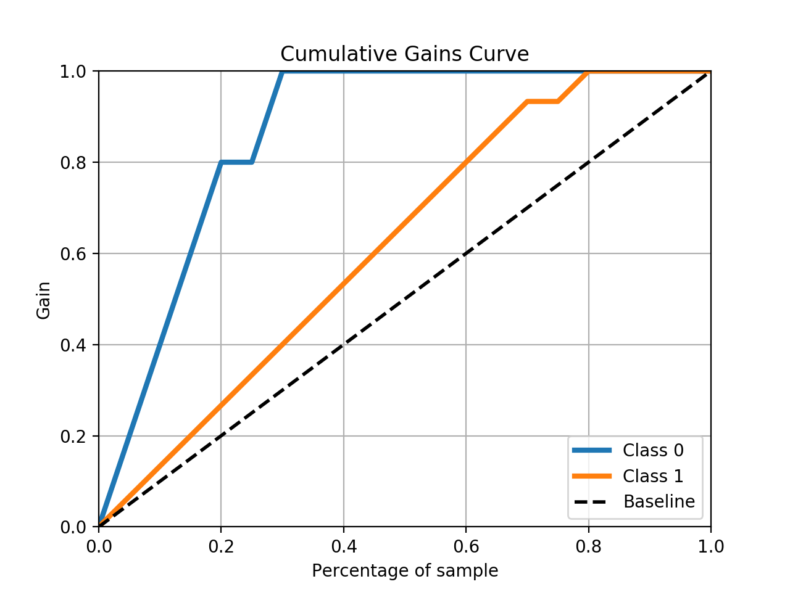

# Cumulative gains vs. ROC curve

I recently ran into an issue interpreting the results of a cumulative gains chart I had developed for some binary classification model. The model had a very high Area Under the Receiver Operating Characteristic Curve (AUROC/AUC), but the gains chart looked like this:



There doesn't seem to be much lift there, does there? At first glance, yes. But upon further investigation, this is simply due to there being a lot of positive cases (75% in the sample) and the model being able to discriminate well between the two classes. Here is my dataset, where

- `y_true` contains the true labels/outcomes
- `y_proba` contains the predicted probability of belonging to the positive class
- `decile` contains decile values off of `y_proba` (10 is the highest; 1 the lowest)
- `target_pct` shows the percent of total positive cases captured/gained across each row, rank-ordering by `y_proba` descendingly
- `random_pct` shows the percent of total positive cases captured/gained across each row, when randomly predicting a positive outcome

```
y_true  y_proba  decile  target_pct  random_pct
     1     0.99      10        0.07        0.05
     1     0.98      10        0.13        0.10
     1     0.97       9        0.20        0.15
     1     0.95       9        0.27        0.20
     1     0.90       8        0.33        0.25
     1     0.88       8        0.40        0.30
     1     0.87       7        0.47        0.35
     1     0.85       7        0.53        0.40
     1     0.84       6        0.60        0.45
     1     0.79       6        0.67        0.50
     1     0.78       5        0.73        0.55
     1     0.76       5        0.80        0.60
     1     0.75       4        0.87        0.65
     1     0.65       4        0.93        0.70
     0     0.54       3        0.93        0.75
     1     0.45       3        1.00        0.80
     0     0.42       2        1.00        0.85
     0     0.30       2        1.00        0.90
     0     0.23       1        1.00        0.95
     0     0.15       1        1.00        1.00
```

As we can see, it simply takes a lot of deciles to show a lot of separation between the built model (as represented by `target_pct`) and a random model (`random_pct`). With so many positive cases and the model being able to separate between the two classes well, it makes sense we wouldn't be able to capture the vast majority of positive cases in just a few deciles, as we often see with other modeling exercises. With only 2 observations per decile (in this example) and 15 positive cases total, even if our model was able to perfectly rank true 1s ahead of true 0s, it would still take until much lower deciles to show just how much separation there is between the positive and negative classes.

And that's the kicker: these metrics are shown for the *positive class only*. We aren't seeing the story as it pertains to the negative cases (which, in many cases, we may be more interested in). Let's see what happens if we plot a lift chart, including lines for both the positive and negative classes:



We see that familiar high degree of separation in the negative class. Building a gains chart for the negative class in the same way we typically do (off of the positive class), shows us that, if we were also interested in the negative class, this model is able to effectively prioritize those cases versus a random baseline.